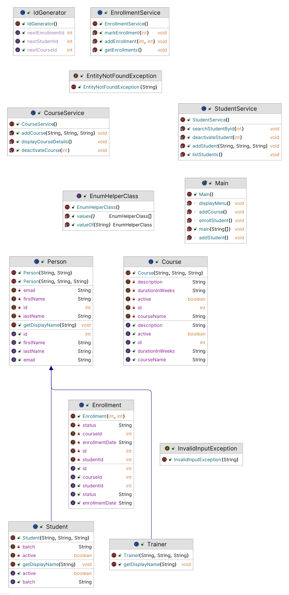

# LearnTrack
Learn track basic java project
A simple Java-based application to manage students, courses, and enrollments.  
Features include adding/viewing students, managing courses, and tracking enrollments.
## Installation
1. Clone the repository:
   ```bash
   git clone https://github.com/mslakshmijaya/LearnTrack
## Features
- Add, view, search, and deactivate students
- Add, view, and deactivate courses
- Enroll students in courses
- View and Cancell enrollments
-
### Run Using IDE
- Open project in IntelliJ / Eclipse
- Navigate to Main.java
- Right-click → Run
## UML Diagram
